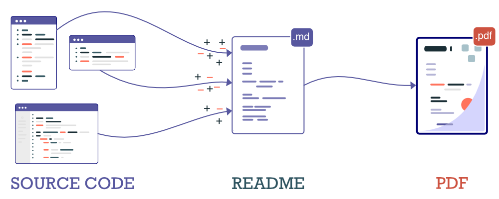

# DEFG
Generate beautiful PDF documentation from code


## How it Works

1. Step 1: Write documentation comments in code (`//**` or `##**` comments)
2. Step 2: `defg` merges comments into your README/markdown file, updating it.
3. Step 3: `defg` uses plugins to generate a beautifully formatted PDF.

As you update the documentation in the code, `defg` will find and merge the
updates, always keeping your markdown and PDF documentation up to date. You can
add images, styling, and layout to the markdown and `defg` will still find and
merge your updates correctly.

<div class="insert-block">

Below is a schematic of how this works:




</div>

## Motivation

I find that README's and other documentations tend to get out of
date quickly. `defg` generates a README from documentation
comments, and as these comments are close
to the code, they are easier to access, modify, and update.

## First Run

If you run `defg` and there is no README.md file, it will generate one from
all the documentation it has found. During this process, because it has no reference,
it can get the order of comments mixed up. If this happens, you need to reorder
the README to get it into shape.

<div class="page-break"></div>

## Improving the README

You can also update your README to make it more readable. You can:
1. Add pictures.
2. Add styling.
3. Add text.
4. Configure the page layout.

As you do all these, `defg` will preserve your changes whenever it updates your README.

<div class="sidenote">

### HOW TO IMPROVE THE README

</img>

- You can add images in markdown or using the `...</div>`.

- To insert a page break insert a `<div class="page-break" />` and add the style to your CSS:
  ```css
  .page-break {
    page-break-after: always
  }

- To design the page layout, create a `pages.defg` file. Here you can decide the page
  size, header & footer using the following Puppeteer options: https://pptr.dev/api/puppeteer.pdfoptions

</div>

<div class="page-break"></div>

## Usage
```
$> defg
  # ensures README contains all 'user documentation' comments (//** or ##** comments)
  # and then generates and opens a PDF with the user documentation
Options
   -h, --help:     show help
   -v, --version:  show version
   --src:          glob paths to source files [can be multiple]
   --skip:         glob paths to exclude/ignore when searching source files
   --ext:          list of valid source file extensions (js,py,java,sql,ts,sh,go,c,cpp by default)
   --readme:       path of README file to merge (./README.md by default)
   --style:        path of CSS file containing styling (./README.css by default)
   --page-def:     path of file containing pdf page definition
   --pdf:          path of output pdf generated (./README.pdf by default)
   --ignore-src:   ignore source and just generate PDF from README.md
   --quick:        use faster (but less accurate) resolution algorithm
   --plugin:       update the documentation or style using this plugin
```